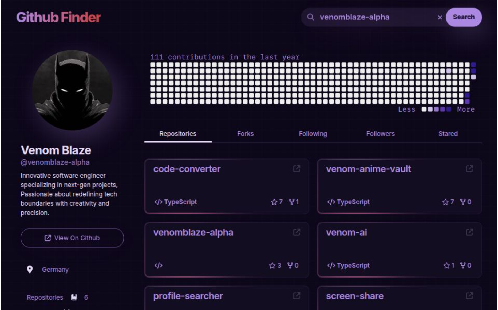

<!-- PROJECT TITLE -->
<h1 align="center">
  Github Finder 🔍
</h1>
<p align="center">
  A sleek, dark‑mode web app that lets you search any GitHub username and instantly explore their profile, contribution graph, repositories, followers, stars and more – all in one place.
  <br />
  <a href="https://github-profilesearcher.vercel.app" target="_blank"><strong>Live&nbsp;Demo&nbsp;»</strong></a>
  <br />
</p>

---

## ✨ Features

| ✨ | What it does |
|----|--------------|
| **Instant search** | Type a username and hit <kbd>Search</kbd> to fetch profile data in real time. |
| **Contribution heat‑map** | Visual year‑long commit graph, color‑scaled from *Less* → *More*. |
| **Tabbed insights** | Quickly switch between **Repositories**, **Forks**, **Following**, **Followers** and **Starred** lists. |
| **Repository cards** | Each repo card shows language, stars, forks and opens in a new tab. |
| **Responsive & themable** | Built mobile‑first with Tailwind CSS; looks great from phone to 4K. |
| **Smooth UX** | Subtle hover animations, skeleton loaders and keyboard focus rings. |

---

## 🖼️ Screenshot

<p align="center">
  
</p>

---

## 🏗️ Tech Stack

- **Next.js 14** + **React 18**
- **TypeScript**
- **Tailwind CSS** for styling
- **Redux Toolkit** for state management
- **GitHub REST API v3** (authenticated requests)
- **Vercel** for zero‑config deployment

---

## 🚀 Getting Started

1. **Clone the repo**

   ```bash
   git clone git@github.com:venomblaze-alpha/github-profile-searcher.git
   cd github-profile-searcher
```
Install dependencies
```
npm install     # or pnpm / yarn
```

Add your GitHub token
Create a .env.local file in the project root:

```
GITHUB_TOKEN=ghp_yourPersonalAccessTokenHere
```

The token is optional but strongly recommended to avoid hitting the GitHub rate‑limit for unauthenticated requests (60 req/hr → 5 000 req/hr).

Run the dev server
```
npm run dev
```
# open http://localhost:3000